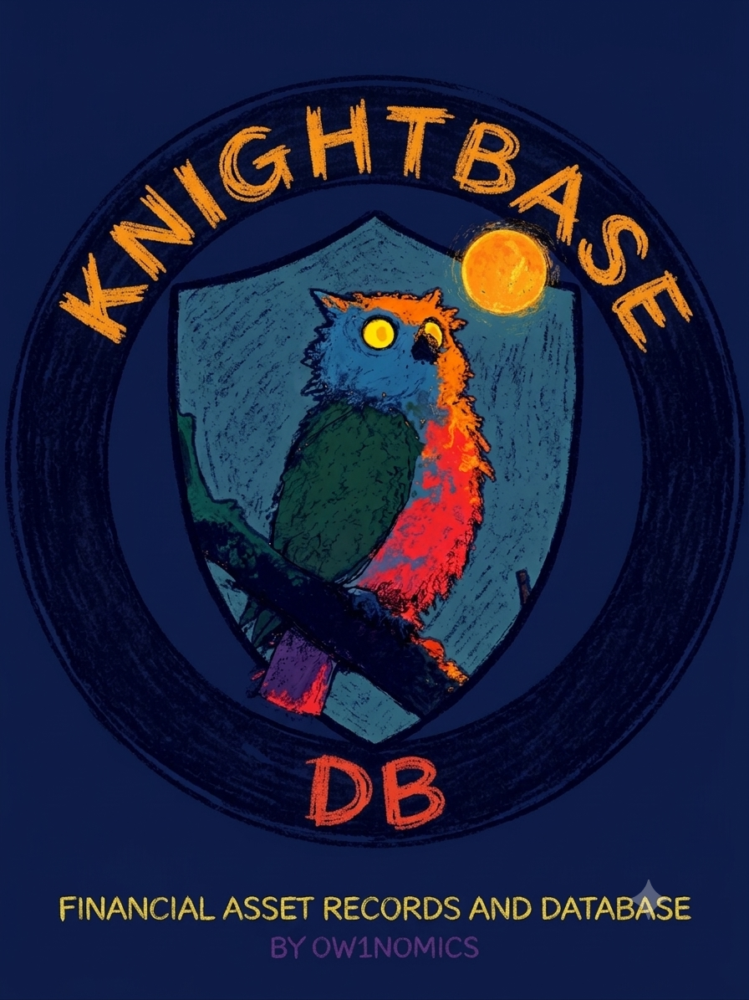

<p align="center">
  
</p>

<h1 align="center">KnightBase</h1>
<p align="center"><b>Financial Asset Records and Database — by Ow1nomics</b></p>
<p align="center">A consolidated, queryable database of Dhaka Stock Exchange (DSE) price history, Bangladesh macroeconomic indicators, and DSE corporate-action disclosures.</p>

---

## What this is

`knightbase.db` is a single SQLite file consolidating multiple public data sources on the Dhaka Stock Exchange and the Bangladeshi macroeconomy into one queryable schema. It is built with one rule above all others:

> **Every skip, every conflict, every rename, and every known gap is logged and queryable — nothing is silently fixed, averaged, or guessed at.**

If a number looks wrong, you can query `data_quality_log` and find out exactly why it's there, or why it isn't.

## Quick stats

| | |
|---|---|
| Price rows | 2,566,157 |
| Unique tickers (all sources combined) | ~870 (raw identifiers; not deduplicated across ID systems — see Known Gaps) |
| Price coverage | 1999-01-10 → 2026-08-06 (with a documented gap; see below) |
| DSEX / DS30 index coverage | 2013-01-30 → 2026-08-06, no gaps |
| Corporate action snapshots | 2 dated snapshots: 2020-12-06 and 2026-08-02 |
| Macro coverage | Bangladesh CPI 1987–2025 (World Bank); Bangladesh Bank CPI/FX/exchange-rate/remittances 1973–2021 + live FX reserves 2024–2026 |
| Data quality log entries | 463 |

---

## Schema

### `prices`
The unified price table. Every source lands here with a `source` tag — nothing is merged or overwritten across sources.

| column | type | notes |
|---|---|---|
| ticker | TEXT | raw identifier as given by the source (see "Ticker identity" below) |
| date | TEXT | ISO YYYY-MM-DD |
| open, high, low, close, volume | REAL | nullable — some sources (Eikon) provide close only |
| source | TEXT | which pipeline this row came from |
| adjusted | INTEGER | 1 only for the 8 genuinely split/dividend-adjusted tickers; 0 for everything else |

**Sources present in `prices`:**
| source value | rows | tickers | date range | notes |
|---|---|---|---|---|
| `dse_archive_unadjusted` | ~1.07M | 505 | 1999–2020 | original audited base |
| `dse_archive_adjusted` | ~14K | 8 | 2012–2020 | only tickers with genuine split/dividend adjustment |
| `prices_eikon` (Refinitiv) | ~1.35M | 364 | 2003–2023 | **close price only**, RIC-style identifiers |
| `bdshare_gap_2025_2026` | 113,829 | 361 | 2025-04-09 → 2026-08-06 | fills the 2020→2025 gap for existing tickers |
| `bdshare_new_companies_2024_2026` | 16,660 | 35 | 2024-08-11 → 2026-08-06 | companies with no prior history in this DB — **see cap limitation below** |

### `price_conflicts`
Schema ready for use: `(ticker, date, source_a, value_a, source_b, value_b, pct_diff, resolved)`. **Currently 0 rows** — this is expected, not a bug: the sources currently loaded don't share overlapping ticker+date pairs (archive ends 2020, gap-fill starts 2025, Eikon uses a different identifier system entirely). If a future source overlaps an existing one, close-price disagreements >0.5% populate here unresolved, for manual review — the pipeline never auto-picks a winner or averages.

### `ticker_renames`
5 confirmed DSE code changes found during this build (old LTD-style code → new PLC-style code):
`ONEBANKLTD→ONEBANKPLC`, `NPOLYMAR→NPOLYMER`, `BSCCL→BSCPLC`, `SALVOCHEM→SALVO`, `LHBL→LHB`. Gap-fill price data for these is stored under the **old** code for consistency with the archive.

### `dsex_index`, `ds30_index`
Clean daily OHLCV for the two DSE benchmark indices, 2013-01-30 → 2026-08-06. No gaps, no dupes.

### `cpi_bangladesh_annual`
World Bank annual CPI inflation, Bangladesh only, 1987–2025. Labeled `annual_partial_macro_worldbank` deliberately — this is inflation only, not general macro data.

### `bb_macro_annual`
Bangladesh Bank's own annual series: CPI (point-to-point, 2005 base), FX reserves (end-period, million USD), exchange rate (buying rate + weighted average, Tk/USD), remittances (million USD and Tk crore). 1973–2021 depending on series. Labeled `annual_partial_macro_bangladeshbank`.

### `bb_fx_reserves_monthly`
Live-pulled from Bangladesh Bank's current FX reserve page. Monthly, gross + BPM6 basis, **July 2024 → June 2026 only** — see gap note below.

### `corporate_action_snapshots`
Two dated, point-in-time snapshots — **not a continuous time series**:
- `2020-12-06`: 235 companies (reconstructed from a Markdown export; see caveat below)
- `2026-08-02`: 81 companies (extracted directly from the source PDF's real table structure — high confidence)

### `eikon_securities`, `data_quality_log`
Carried forward from the original audited `dse_master.db`, extended with 180 new entries from this build (gap tickers, cap limitations, corrupted-source exclusion, parsing caveats — see below).

---

## Known gaps (read this before trusting a "0 rows returned")

**Ticker identity is not unified across sources.** Archive uses plain DSE trading codes (`ACI`), Eikon uses RIC-style identifiers (`ACIF.DH(P)`), and no mapping table links them. A query for "ACI's full 1999–2026 history" will only return the archive+gap-fill rows, not Eikon's, unless you know to check both identifier systems.

**112 tickers have no data anywhere from 2020 to 2026.** These traded at some point in the archive (1999–2020) but returned nothing when queried for 2025–2026 — confirmed via repeated retries, not a network fluke. Query `data_quality_log WHERE issue='no_data_apr2025_aug2026'` for the full list and whether each was already dead before the archive ended (`suspended_or_delisted_before_archive_end_2020`) or went dark sometime after (`suspended_or_delisted_after_archive_end_2020`).

**35 "new company" tickers only have data back to August 2024**, even for companies that plausibly existed earlier — this is a confirmed limitation of the `bdshare` library's `get_hist_data` function, which silently caps historical range at ~476 trading days regardless of the requested start date (verified by testing it against `ONEBANKPLC`, a ticker known to have data back to 1999). **This means "no data before Aug 2024" is not proof the company didn't trade before then** — it's proof the tool wouldn't return it. Full manual backfill via `dsebd.org`'s own archive tool, one ticker at a time, remains undone.

**Macro data has a 2021–2024 hole.** Bangladesh Bank's own downloadable historical file and "monthly trends" file (despite its name) both stop at FY2020-21. The live FX-reserves page only goes back to July 2024. Nothing currently in this database covers CPI, FX reserves, or exchange rate for that ~3-year window.

**No usable interest/policy rate series.** Bangladesh Bank publishes bond-level instrument data (individual ISINs, coupon rates, issue dates) rather than a clean policy-rate time series, and their live interest-rate page is a query form (one month/year at a time), not bulk-exportable. Not collected.

**Corporate actions beyond the two snapshot dates: not collectable retroactively.** DSE doesn't publish a historical AGM/dividend feed — only current notices. The two snapshots here are the only two "photographs" available; the gap between Dec 2020 and Aug 2026 cannot be filled after the fact.

**Fundamentals (balance sheet, income statement) are not in this database.** They live in a separate companion repo, [Datanest](https://github.com/o-rnob/Datanest), covering 11 DSE-listed banks.

**The Dec 2020 AGM snapshot was reconstructed from a Markdown table export**, not a clean table extraction like the 2026 PDF snapshot — a small number of rows may have fields shifted (e.g., a shareholding percentage landing in the `time` column) where a company's record had unusual extra or missing fields. The Aug 2026 snapshot came from direct PDF table extraction and is high-confidence.

**One uploaded source was corrupted and excluded entirely, not repaired or guessed at:** a `merged.csv` covering the "Unadjusted Data" folder of a secondary historical zip had 504 of 505 per-ticker files completely empty, with all ~1.1M data rows dumped under a mislabeled `ZEALBANGLA` section containing values (~1,800) far too high to be that company's actual stock price — almost certainly an index series mislabeled during export. Logged in `data_quality_log`, not included in `prices`.

**Index/sector aggregate rows were mixed into the original archive source and have been excluded**, not silently kept: 30,192 rows tagged as index-level (`DSEX`, `DS30`, `Index_00DSEGEN`...) or sector-aggregate (`Sector_Bank`, `Sector_Insurance`...) data were sitting in what should have been a pure per-company price table. These are logged, not deleted from history — just kept out of `prices` to avoid polluting per-ticker queries.

---

## Sources & attribution

| Source | What it provided | License / terms |
|---|---|---|
| Original `dse_master.db` audit (prior work) | Archive base, Eikon prices | Own compiled work |
| [`bdshare`](https://pypi.org/project/bdshare/) (Python package) | 2025–2026 price gap-fill, new-company prices | Scrapes `dsebd.org` public pages |
| Dhaka Stock Exchange (`dsebd.org`) | Underlying live price/company/AGM data | Public disclosure, DSE's own terms apply |
| Bangladesh Bank (`bb.org.bd`) | CPI, FX reserves, exchange rate, remittances | Public statistics, BB's own terms apply |
| World Bank Open Data | Bangladesh CPI (World Bank series) | [CC BY 4.0](https://datacatalog.worldbank.org/public-licenses) |
| investing.com exports | DSEX, DS30 index history | User-exported; investing.com's own terms apply for redistribution |
| Mendeley/Harvard Dataverse DSE dataset | Referenced for cross-validation during audit; **not currently loaded into `prices`** | See original dataset's license before use |

This repository's **code and schema** are MIT licensed (see `LICENSE`). The **underlying data** originates from the third parties above — verify their individual terms before redistributing the data itself at scale.

---

## Citation

See `CITATION.cff`. In short:

```
Ornob, K. M. Miad Hassan (Ow1nomics). (2026). KnightBase: A Consolidated
Financial Asset Database for the Dhaka Stock Exchange (1999-2026).
https://github.com/o-rnob/knightbase
```

---

## A note on the name

This is described as a comprehensive, consolidated open-source dataset for DSE — genuinely one of the more complete ones assembled outside an institution, to the builder's knowledge. It has not been formally benchmarked against every other Bangladesh financial dataset that may exist, so claims of being the single largest/most comprehensive should be read as the builder's good-faith assessment, not a verified superlative.
